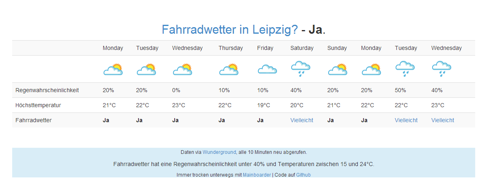

Fahrradwetter
=============

Kann man mit dem Fahrrad fahren?

Cronjob
========

Erstelle einen Cronjob:

*/10 * * * * wget -N --quiet --output-document=/path/to/programm/api.json http://api.wunderground.com/api/YOUR_API_KEY/forecast10day/q/COUNTRYCODE/CITY.json

Beispiel:
*/10 * * * * wget -N --quiet --output-document=/var/www/customers/cust123/html/bike/api.json http://api.wunderground.com/api/abc1234def/forecast10day/q/DE/Leipzig.json

Die Datei api.json und index.php müssen im gleichen Verzeichnis liegen und vom Webserver lesbar sein. Zudem muss api.json durch den Nutzer des Cronjobs beschreibbar sein.

Screenshot / Demo
==========

Demo unter http://fahrradwetter.mainboarder.de/

Lizenz
=======

Nicht militärische und nicht geheimdienstliche Nutzung und Weiterentwicklung für jedermann entgeltfrei erlaubt, solange die Hinweise des Urhebers nicht entfernt werden.
